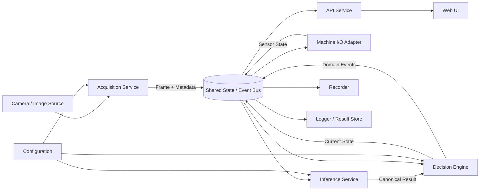
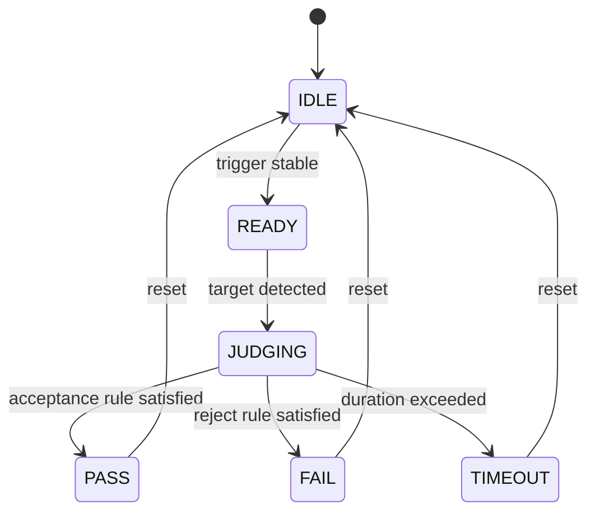
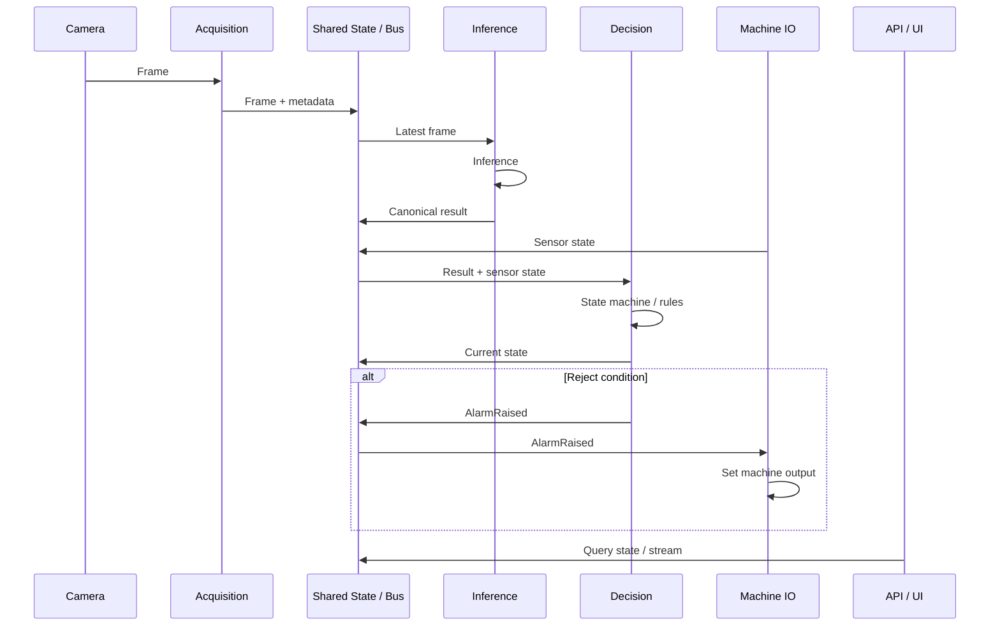

# Edge Machine Vision Template

A runnable, vendor-neutral **project scaffold** for industrial Edge Machine Vision systems.

## Runnable Scaffold

This repository now contains an executable reference implementation with:

- Fake Camera
- Fake Inference Engine
- canonical domain DTOs
- pure Decision Engine / State Machine
- Mock Machine I/O
- Redis state repository + event publication
- FastAPI health/state/demo endpoints
- Docker Compose
- YAML configuration
- Recorder interface
- pytest unit tests
- GitHub Actions CI

### Quick Start

```bash
git clone https://github.com/jett-lin1997/edge-machine-vision-template.git
cd edge-machine-vision-template
cp .env.example .env
docker compose up --build
```

Then verify:

```bash
curl http://localhost:8000/api/health
```

Advance the fake inspection one frame at a time:

```bash
curl -X POST http://localhost:8000/api/demo/step \
  -H 'Content-Type: application/json' \
  -d '{"trigger": true}'
```

Inspect current state:

```bash
curl http://localhost:8000/api/state
```

Reset the demo cycle:

```bash
curl -X POST http://localhost:8000/api/demo/reset
```

### Local Tests

```bash
python -m venv .venv
source .venv/bin/activate
pip install -r backend/requirements-dev.txt
pytest -q
```

The included Decision Engine tests cover PASS, FAIL, and trigger-reset behavior.

### Extension Points

Replace these adapters without rewriting the rest of the system:

| Boundary | Default | Replace with |
|---|---|---|
| Acquisition | `FakeCamera` | V4L2 / Basler / Hikrobot / file source |
| Inference | `FakeInferenceEngine` | YOLO / OBB / OCR / classifier / segmentation |
| Decision | generic state machine | project-specific inspection rules |
| Machine I/O | `MockIO` | Modbus RTU/TCP / PLC / digital I/O |
| State transport | Redis | Redis Streams / NATS / other repository |
| Recording | `NullRecorder` interface | video / snapshot / evidence recorder |

See [docs/EXTENDING.md](docs/EXTENDING.md) before integrating production hardware.

### Current Repository Structure

```text
.
├── .github/workflows/ci.yml
├── config/default.yaml
├── backend/
│   ├── Dockerfile
│   ├── requirements.txt
│   ├── requirements-dev.txt
│   └── vision_app/
│       ├── acquisition/
│       ├── inference/
│       ├── decision/
│       ├── io/
│       ├── recording/
│       ├── repositories/
│       ├── services/
│       ├── api.py
│       ├── config.py
│       └── domain.py
├── frontend/README.md
├── models/README.md
├── tests/unit/
├── docker-compose.yml
├── Makefile
└── pytest.ini
```

---

A reusable, vendor-neutral reference architecture for industrial **Edge Machine Vision** systems.

## Core Architecture

```text
Image Source
    ↓
Acquisition
    ↓
Frame Transport / Shared State
    ↓
Inference / Perception
    ↓
Decision Engine / State Machine
    ↓
Domain Events / System State
    ↓
Machine I/O · API · UI · Recorder · Logger
```



## Design Principles

1. **Separate perception from decision logic.**  
   AI answers what is visible; the Decision Engine decides what it means for the machine.

2. **Separate state from events.**  
   State answers “what is true now”; events answer “what just happened”.

3. **Use canonical inference results.**  
   Business logic should not depend directly on Ultralytics, TensorRT, ONNX Runtime, PyTorch, OpenVINO, or OCR framework objects.

4. **Treat hardware as replaceable adapters.**  
   Camera, PLC, Modbus, serial I/O, and vendor SDK integrations should implement common interfaces.

5. **Make thresholds configuration, not source code.**

6. **Build fake implementations first.**  
   Fake Camera, Fake Inference, and Mock I/O make the system testable without real equipment.

7. **Preserve operational evidence.**  
   Record model version, config version, timestamps, raw/annotated evidence, and machine state.

## Recommended Layers

### Acquisition

Responsibilities:

- Open and reconnect to image sources.
- Read frames.
- Apply camera configuration.
- Attach `camera_id`, `frame_id`, and timestamp.
- Publish the latest frame.

Example interface:

```python
from abc import ABC, abstractmethod

class FrameSource(ABC):
    @abstractmethod
    def open(self) -> None:
        ...

    @abstractmethod
    def read(self):
        ...

    @abstractmethod
    def close(self) -> None:
        ...
```

Possible implementations:

```text
V4L2Camera
VendorSDKCamera
VideoFileSource
ImageDirectorySource
FakeCamera
```

### Frame Metadata

```python
from dataclasses import dataclass

@dataclass
class FrameMeta:
    camera_id: str
    frame_id: int
    timestamp_ns: int
    width: int
    height: int
```

### Shared State / Event Bus

Useful state keys:

```text
camera:top:frame
camera:top:config
camera:top:status
inference:top:result
machine:io:inputs
inspection:current
alarm:active
```

Useful event channels:

```text
event:camera
event:inspection
event:alarm
event:model
event:recording
```

Redis is one suitable implementation for a small or medium edge deployment.

- Key / Hash → current state
- Pub/Sub → transient event
- Redis Streams → durable event

### Inference

```python
class InferenceEngine:
    def infer(self, image) -> "InferenceResult":
        raise NotImplementedError
```

Possible adapters:

```text
YoloDetectEngine
YoloObbEngine
ClassificationEngine
OcrEngine
SegmentationEngine
AnomalyDetectionEngine
```

Canonical DTO:

```python
from dataclasses import dataclass

@dataclass
class Detection:
    class_id: int
    class_name: str
    confidence: float
    bbox: tuple | None = None
    polygon: list | None = None

@dataclass
class InferenceResult:
    camera_id: str
    frame_id: int
    timestamp_ns: int
    detections: list[Detection]
    latency_ms: float
```

### Decision Engine

```python
class DecisionEngine:
    def update(
        self,
        inference_result,
        sensor_state,
        timestamp_ns,
    ) -> list["DomainEvent"]:
        ...
```

Typical inputs:

```text
Inference Result
Sensor State
Current State
Time
Configuration
```

Typical outputs:

```text
StateChanged
InspectionStarted
InspectionCompleted
AlarmRaised
AlarmCleared
```

### State Machine



### Temporal Filtering

Single-frame results should rarely control equipment directly.

Useful techniques:

```text
Consecutive-frame confirmation
Sliding-window voting
NG counters
Confidence thresholding
Debouncing
Hysteresis
Timeout rules
```

Example configuration:

```yaml
decision:
  ready_consecutive_frames: 5

  inspection:
    window_frames: 20
    reject_threshold: 4

  timeout_frames: 150
```

### Machine I/O

```python
class MachineIO:
    def read_inputs(self) -> dict:
        ...

    def write_output(self, name: str, value: bool) -> None:
        ...
```

Possible adapters:

```text
ModbusRTUAdapter
ModbusTCPAdapter
VendorPLCAdapter
DigitalIOAdapter
MockIOAdapter
```

### Sensor Fusion

```text
Vision Result
    +
Physical Sensor
    +
Machine State
    ↓
Decision Engine
    ↓
Final Judgement
```

### API

Recommended surface:

```text
GET    /api/health
GET    /api/cameras
GET    /api/cameras/{id}/status
GET    /api/cameras/{id}/stream/raw
GET    /api/cameras/{id}/stream/annotated
GET    /api/config
PUT    /api/config
GET    /api/inspection/current
GET    /api/alarms
DELETE /api/alarms/{id}
GET    /api/system/status
```

### Recorder / Evidence

Recommended evidence:

```text
Raw Video
Annotated Video
Alarm Snapshot
Inference Result
Sensor State
Configuration Version
Model Version
Timestamp
```

### Observability

Useful metrics:

```text
Camera FPS
Inference FPS
Inference Latency
Frame Lag
Dropped Frames
GPU Utilization
GPU Memory
Shared-state Latency
Disk Usage
Camera Reconnect Count
Alarm Count
Process Health
```

## Suggested Repository Structure

```text
edge-machine-vision-template/
│
├── README.md
├── docker-compose.yml
├── .env.example
│
├── config/
│   └── default.yaml
│
├── models/
│   └── README.md
│
├── backend/
│   └── src/
│       ├── acquisition/
│       │   ├── base.py
│       │   └── fake.py
│       ├── inference/
│       │   ├── base.py
│       │   ├── result.py
│       │   └── fake.py
│       ├── decision/
│       │   ├── state.py
│       │   ├── engine.py
│       │   └── rules.py
│       ├── io/
│       │   ├── base.py
│       │   └── mock.py
│       ├── repositories/
│       ├── api/
│       ├── recording/
│       └── common/
│
├── frontend/
│
└── tests/
    ├── unit/
    ├── integration/
    └── fixtures/
```

## Runtime Sequence



## Real-Time Backpressure

If:

```text
Camera = 30 FPS
Inference = 10 FPS
```

do not blindly queue every frame for a real-time system.

A common strategy is:

> **Latest-frame strategy**

The inference worker always consumes the newest available frame.

Use a durable queue only when every frame must be processed.

## Testing

### Unit Test

Prioritize:

```text
State Machine
Decision Rules
Thresholds
Counters
Geometry
Config Validation
Result Conversion
```

### Integration Test

Use:

```text
Fake Camera
Fake Inference
Mock I/O
Shared State
Real API
```

### Model Regression Test

Track:

```text
Precision
Recall
False Accept
False Reject
Latency
```

## Deployment

Typical Docker Compose layout:

```text
shared-state
api/backend
inference
frontend
```

Split services based on real operational boundaries such as:

- GPU runtime
- dependencies
- restart isolation
- security
- deployment lifecycle

Use least privilege for device mounts and ports.

## Development Order

```text
1. Define domain and inspection cycle
2. Define PASS / FAIL / alarms
3. Draw state machine
4. Implement Fake Camera / Fake Inference / Mock I/O
5. Implement Decision Engine
6. Integrate real model
7. Integrate real equipment
8. Add recorder, logging, health, metrics
9. Add model/config version tracking
10. Validate with regression tests
```

## Mental Model

Do not design the project as:

```text
YOLO script
```

Design it as:

```text
Acquisition
    ↓
Perception
    ↓
Decision
    ↓
Integration
    ↓
Evidence + Operations
```

In domain language:

> **See → Understand → Decide → Act → Record**

The model is replaceable.  
The reusable engineering value is the system around it.

## Publication Note

This public architecture intentionally excludes:

- Company names
- Customer details
- Production device paths
- Production IP addresses
- Actual I/O mappings
- Proprietary model names
- Production thresholds
- Internal alarm semantics
- Private source code
